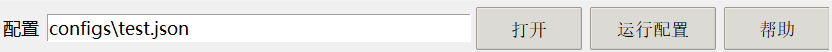
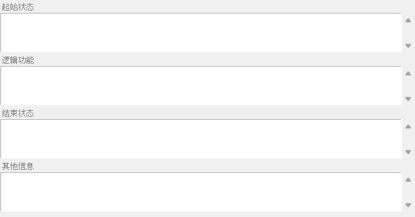
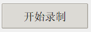
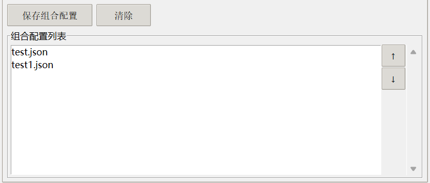
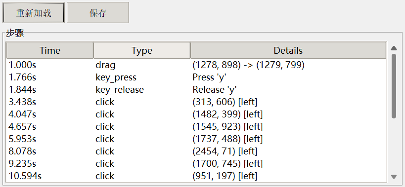
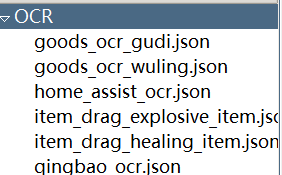
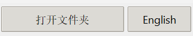
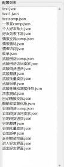

# Endfield Helper

游戏《明日方舟：终末地》windows版的自动收菜助手。

# 基本结构

## 设计思路

这是一个基于“录制”和“回放”操作的终末地自动助手，玩家可以将重复的每日任务操作录制为脚本，通过播放脚本的方式实现日常的自动化。除了游戏内操作的录制和回放外，助手内置了一些基于图像识别或OCR的复杂模块，作为一些“非固定”任务的自动化组件（例如，游戏中的弹性物资买卖）。

## 助手可以做什么？

基建自动收菜、基建发快递收快递、基建自动倒货、环境检测接单、每日五次情报交流、清理背包、自动送快递（需要玩家录制自己的快递路线）等。

这些操作都提供了预置脚本，但由于此工具的点击操作基于屏幕坐标（屏幕长宽比2560：1600），因此在不同的显示设备上可能失效。不过，玩家也可以录制自己的脚本，或编辑预置脚本来适配自己的电脑。

## 助手不能做什么？

帝江号收菜（技术上没有难题，但需要比较复杂的识别逻辑控制）、自动收集稀有采集物（技术上没有难题，工作量比较大，运行耗时会很长）、自动战斗清体力（自动战斗不好做，不同队伍轴和练度不一样，很难打定番，暂时不考虑）、各种活动的自动化（非每日日常，开发收益小，没必要）、自动收取邮件（技术上没有难题，开发中）

## 架构相关

完全采用Python实现，代码纯ai生成零手工。配置文件使用json格式。图片模板templates使用png格式游戏截图。

# 使用说明

## 下载

从右侧release中下载最新版压缩包.zip，解压后包含一个exe和必要的configs文件夹和templates文件夹，右键exe**以管理员身份运行**。

## 用户界面

输入配置路径/打开配置文件/运行配置文件（在游戏内重放配置文件记录的一系列操作，用快捷键Ctrl+X停止回放）

备注：为配置文件写一段注释，切换配置或关闭时自动保存，选择配置时会加载。

录制/组合/编辑面板：助手的三种工作模式。录制模式下，可以记录游戏内的操作到配置文件（timeline configs），这些配置会记录每个操作的时间点，并在回放时根据时间点自动触发操作，不考虑前一步操作是否已经完成；组合模式下，可以将多个现有配置文件排列形成新的配置文件（composition configs），这些配置没有时间点的概念，回放时会逐个回放内部的所有子操作，当一个子操作完成后才会运行下一个子操作；编辑模式下，可以对两种配置文件做一些细节编辑和修改。

在录制面板下，点击开始录制，当用户界面隐藏后，开始一段操作录制，录制结果会写入配置栏的json文件。**结束录制需要按快捷键Ctrl+X**。如果配置栏的json文件是已经存在的配置，开始录制时会提醒是否覆盖。技巧：开始录制后可以先左键平a一下让终末地获取焦点，否则直接按键盘可能没反应。

可以录制的操作：
- 鼠标点击、拖拽、长按
- 键盘按键（按下和松开分别记录）
- 键盘上下左右方向键代替鼠标进行3D场景下的视角调整，录制方式和键盘按键一致(注意，上下左右键本质还是生成鼠标相对位移信号，因此受到游戏内鼠标灵敏度影响。如果调整了鼠标灵敏度，一些预设配置中的视角操作会产生偏差)

不可以录制的操作：
- **鼠标移动** (所以，录制3D场景下的动作序列时，请用方向键调整视角，不要动鼠标)

录制面板主要用于记录一些固定的操作序列，如一段固定位置的点击、一段固定的角色移动等。

在组合面板下，双击右侧配置列表的中的配置可以添加配置到组合，双击组合配置中的配置可以将其移出列表，点击保存可以将当前组合配置保存到配置栏对应的json中。如果配置栏的json文件是已经存在的配置，保存时会提醒是否覆盖。

组合面板主要用于将多个录制得到的配置（甚至其他组合配置）排列成一个更复杂的自动化脚本，例如将多个收菜功能的配置排列得到一个一键脚本。

在编辑面板下，选中右侧配置列表中的配置可以展示配置的每一步操作，从而对其进行编辑。对于timeline configs，右键一个条目可以进行删除、在上方、下方添加、重新录制等操作。其中，后三种操作都将开启一段新的录制，并将录制结果添加在原来操作的上方/下方，或者替换原来的操作，后面的操作的时间点会根据插入操作的时间进行调整。重录操作仍使用Ctrl+X结束。双击条目的时间可以手动修改时间点。对于composition configs，右键一个条目可以进行删除、在上方、下方添加。添加操作允许用户选择一个json config插入指定位置。

重新加载用于重新从本地加载最新的config本地文件数据，保存用于将编辑过的config保存到本地（只有点了保存修改才会真正生效！）

编辑面板主要用于微调某些配置。如果一个配置只有一小部分没有录好，可以在编辑面板进行重录。

ocr操作栏：助手提供了几种预设的ocr操作，默认不激活，双击可以将其添加到激活栏，激活的操作使用Ctrl+Shift+1-9（大键盘）进行调用。加载后，即使不是录制状态，也可以使用快捷键调用ocr操作，你可以在正式录制前先试一试它们好不好用。

以下是几种ocr操作的功能列表：

- ocr名称 | 起始状态 | 功能 | 结束状态
- goods_ocr(gudi) | 谷地弹性物资面板 | 找到降价幅度最大的物资并点击 | 点击物资后弹出购买物资面板
- goods_ocr(wuling) | 武陵弹性物资面板 | 找到降价幅度最大的物资并点击 | 点击物资后弹出购买物资面板
- qingbao_ocr | 好友列表 | 找到可以情报交流的好友进行访问交流，直到5次上限或识别次数上限 | 好友列表
- item:healing_item | 帝江号背包界面 | 找到匹配的物品并拖拽到右边 | 帝江号背包界面
- item:explosive_item | 帝江号背包界面 | 找到匹配的物品并拖拽到右边 | 帝江号背包界面

hints：goods_ocr识别相对较慢，操作完后请等待几秒钟。item物品识别并从仓库移动到背包的功能，如果有其他需求，可以手动截图物品图标并替换templates中对应的图标，就可以识别拿取其他物品（例如，不想用紫药想用武陵针剂）

打开文件夹：将一个文件夹内的json配置加载到列表，English：切换英文

配置列表：加载的文件夹中的所有配置，点击可以将配置路径加载到配置栏。右键点击配置可以用默认编辑器打开，对json源文件进行编辑。

# 预置配置

- 谷地/武陵基建：在3D场景下使用，结束状态为3D场景。在据点管理界面进行自动卖货换券。
- 谷地/武陵倒货comp：在3D场景下使用，结束状态为3D场景。分为四步：1.调用goods_ocr买入降价幅度最高的货物，2.访问该货物售价最高的好友飞船，3.走到物资调度终端面板，4.在终端面板一键售出所有购入的物资。（注意，这并不是收益最高的做法）
- 谷地/武陵派单：在3D场景下使用，结束状态为3D场景。自动接取每日的送货任务并派单。（如果要自己送货，请不要。
- 收单：在3D场景下使用，结束状态为3D场景。自动收取你派出的快递单。
- 武陵环境检测接任务：在3D场景下使用，结束状态为3D场景。接取武陵拍照任务（暂不支持做任务）。
- 情报交流comp：在3D场景下使用，结束状态为3D场景。自动完成五次情报交流（做不满也会结束）。分为三步：1.进入好友列表，2.调用qingbao_ocr，3.退出好友列表。
- 背包整理：在帝江号上使用，结束状态为帝江号。自动清理背包中的物品。打开背包后，首先执行一键存放，然后切换到可用道具仓库，调用item:healing_item和item:explosive_item将血药和爆炸物拿一组到仓库。
- 送礼comp：在帝江号会客室传送点状态使用，结束状态为回到会客室。分为五步：1.从会客室走到干员联络台，2.呼叫干员（自动呼叫好感度最低的干员），3.微调位置靠近干员，4.按F进入对话并送礼（要求有可以送的礼物），5.传送回到会客室。（步骤3、4仍需更多测试，干员的位置有一定随机性，有些干员可能会先给我们送礼物，目前没刷出来）

# 开发

1.git clone https://github.com/mikiisayakaa/EndfieldHelper.git
2.pip install -r requirements.txt
3.右键cmd，管理员身份启动，导航到文件夹内，python main.py
4.运行build.bat进行打包，打包exe生成在dist文件夹内
5.运行结果和错误信息可以查看endfield_helper.log
