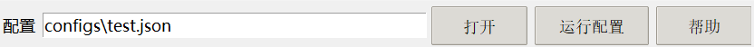
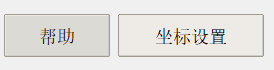
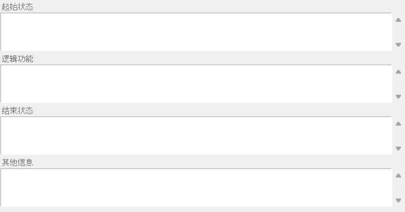
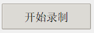
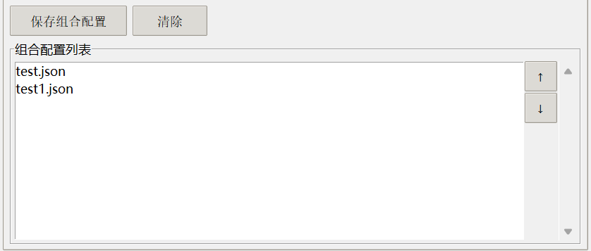
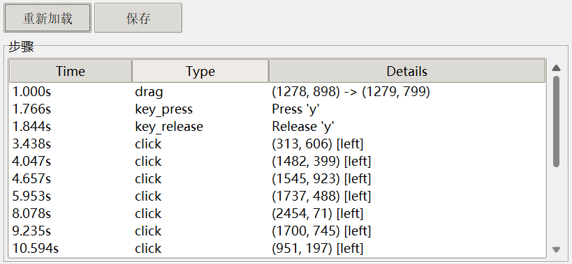
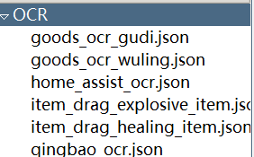
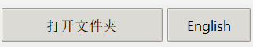
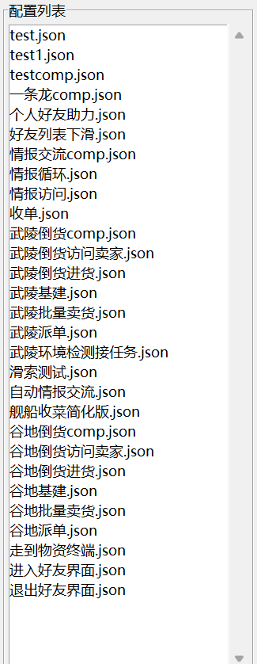

# Endfield Helper

游戏《明日方舟：终末地》windows版的自动收菜助手。

# 基本结构

## 设计思路

这是一个基于“录制”和“回放”操作的终末地自动助手，玩家可以将重复的每日任务操作录制为脚本，通过播放脚本的方式实现日常的自动化。除了游戏内操作的录制和回放外，助手内置了一些基于图像识别或OCR的复杂模块，作为一些“非固定”任务的自动化组件（例如，游戏中的弹性物资买卖）。

## 助手可以做什么？

基建自动收菜、基建发快递收快递、基建自动倒货、环境检测接单、每日五次情报交流、清理背包、帝江号收菜、自动送礼、自动收集稀有采集物等。

这些操作都提供了预置脚本，玩家也可以录制自己的脚本，或编辑预置脚本来适配自己的应用场景。

## 助手不能做什么？

自动战斗清体力（自动战斗不好做，容易丢锁定或者暴毙，暂时不考虑）、一些其他自动化（如自动花信用点、自动收日常和通行证、自动收邮件等，个人习惯手操了，如有需要可以做）

## 使用前提醒！！

由于助手仅在必要时使用图像识别，大部分操作都来自个人录制的操作脚本，直接使用脚本可能遇到：1.点击位置不对（屏幕长宽比不是16：10可能遇到，看使用说明里如何设置分辨率和偏移），2.时间轴乱轴（电脑配置不同，有些过场加载时间可能比预设长），3.按键错误（使用了非默认的终末地键盘映射）。强烈建议前几次使用脚本先全程盯一下看看有没有问题，所以如果出错情况不多，建议使用编辑功能修改一下具体配置或者自己重录一段，如果出错情况很多修改麻烦，只能抱歉找一下其他脚本了。

## 架构相关

完全采用Python实现，代码纯vibe coding。配置文件使用json格式。图片模板templates使用png格式游戏截图。

# 使用说明

## 下载和运行

从右侧release中下载最新版压缩包.zip，解压后包含一个exe和必要的configs文件夹和templates文件夹，右键exe**以管理员身份运行**。

## 用户界面

输入配置路径/打开配置文件/运行配置文件（在游戏内重放配置文件记录的一系列操作，**用快捷键Ctrl+X停止回放**）

坐标设置：设置终末地的分辨率和左上角坐标，设置不匹配会导致点击位置出错。小助手需要在16:10的分辨率下运行，默认分辨率(2560,1600)，如果你的电脑不是以2560 * 1600全屏运行终末地，请在终末地设置中选择一个相同比例的分辨率运行，如1920 * 1200或1600 * 1000。修改后，将分辨率应用到小助手的坐标设置。如果以窗口模式运行终末地，需要记录窗口左上角的坐标(游戏画面左上角，不是标题栏左上角)写到坐标设置的偏移中。小助手右下角会实时显示鼠标坐标，将鼠标移动到终末地游戏窗口的左上角即可显示偏移值。

备注：为配置文件写一段注释，写完后需要手动点保存。注释格式为：1.起始状态：配置需要在什么场景下开始运行，2.逻辑功能：配置文件做什么，3.结束状态：配置文件结束后的场景，4.其他信息。

录制/组合/编辑面板：助手的三种工作模式。录制模式下，可以记录游戏内的操作到配置文件（timeline configs），这些配置会记录每个操作的时间点，并在回放时根据时间点自动触发操作；组合模式下，可以将多个现有配置文件排列形成新的配置文件（composition configs），这些配置没有时间点的概念，回放时会逐个回放所有配置文件，当一个子操作完成后才会运行下一个子操作；编辑模式下，可以对两种配置文件做一些细节编辑和修改。

在录制面板下，点击开始录制，当用户界面隐藏后，开始一段操作录制，录制结果会写入配置栏的json文件。**结束录制按快捷键Ctrl+X**。如果配置栏的json文件是已经存在的配置，开始录制时会提醒是否覆盖。技巧：开始录制后可以先左键平a一下让终末地获取焦点，否则直接按键盘可能游戏里没反应。

可以录制的操作：
- 鼠标点击、拖拽、长按
- 键盘按键（按下和松开分别记录）
- 键盘上下左右方向键代替鼠标移动进行3D场景下的视角调整，录制方式和键盘按键一致(注意，上下左右键本质还是生成鼠标相对位移信号，因此受到游戏内鼠标灵敏度影响。如果调整了鼠标灵敏度为非0，一些预设配置中的视角操作会产生偏差)

不可以录制的操作：
- **鼠标移动** (所以，录制3D场景下的动作序列时，请用方向键调整视角，不要动鼠标)

录制面板主要用于记录一些固定的操作序列，如一段固定位置的点击、一段固定的角色移动等。

在组合面板下，双击右侧配置列表的中的配置可以添加配置到组合，双击组合配置中的配置可以将其移出列表，点击保存可以将当前组合配置保存到配置栏对应的json中。如果配置栏的json文件是已经存在的配置，保存时会提醒是否覆盖。

组合面板主要用于将多个录制得到的配置（甚至其他组合配置）排列成一个更复杂的自动化脚本，例如将多个收菜功能的配置排列得到一个一键脚本。预设配置中，组合配置都以comp为结尾命名。

在编辑面板下，选中右侧配置列表中的配置可以展示配置的每一步操作，从而对其进行编辑。对于timeline configs，右键一个条目可以进行删除、在上方、下方添加、重新录制等操作。其中，后三种操作都将开启一段新的录制，并将录制结果添加在原来操作的上方/下方，或者替换原来的操作，后面的操作的时间点会根据插入操作的时间进行调整。重录操作仍使用Ctrl+X结束。双击条目的参数可以手动修改时间点、操作类型、操作坐标和持续时间等细节。提前/延后功能将当前操作和之后所有操作一起提前/延后x秒。对于composition configs，右键一个条目可以进行删除、在上方、下方添加其他配置。

重新加载用于重新从本地加载最新的config本地文件数据，保存用于将编辑过的config保存到本地（只有点了保存修改才会真正生效！）

编辑面板主要用于微调某些配置。如果一个配置只有一小部分没有录好，可以在编辑面板进行重录。

ocr操作：助手提供了几种预设的ocr操作config，放在configs/OCR文件夹下，具体功能请在助手内查看对应的注释。

打开文件夹：将一个文件夹内的json配置加载到列表，English：切换英文

配置列表：加载的文件夹中的所有配置，点击可以将配置路径加载到配置栏。右键点击配置可以用默认编辑器打开，对json源文件进行编辑。也可以删除、复制粘贴配置，建议修改预设配置时先复制一份。

# 预置配置

- 谷地/武陵基建：在据点管理界面进行自动卖货换券。
- 谷地/武陵倒货comp：自动倒货（具体逻辑请看助手内的注释，每日买最低价然后找好友最高价卖出，收益不如囤货）
- 谷地/武陵派单：自动接取每日的送货任务并派单。（如果要自己送货，请不要使用这个功能）
- 收单：自动收取你派出的快递单。
- 武陵环境检测接任务：接取武陵拍照任务（暂不支持做任务）。
- 情报交流comp：自动完成五次情报交流（做不满也会结束）。
- 背包整理：自动清理背包中的物品。一键清空后拿取紫药和爆炸物。
- 送礼comp：自动找好感度最低的干员送礼（送礼两次，解决第一次是收礼的情况）
- 帝江号收菜：自动完成帝江号主控面板的线索、制造站、培养仓的收获、再生产。
- 自动采集（实验性）：预设了五个自动采集脚本，由于自动采集点太多，需要评估后再进行大量开发。
- 一条龙comp：包含除了自动采集之外的所有功能，自动顺序完成上述所有日常。

# 开发

- git clone https://github.com/mikiisayakaa/EndfieldHelper.git
- 安装python 3.12（建议开一个conda环境）
- pip install -r requirements.txt
- 右键cmd，管理员身份启动，导航到文件夹内，python main.py
- 运行build.bat进行打包，打包exe生成在dist文件夹内
- 运行结果和错误信息可以查看endfield_helper.log
